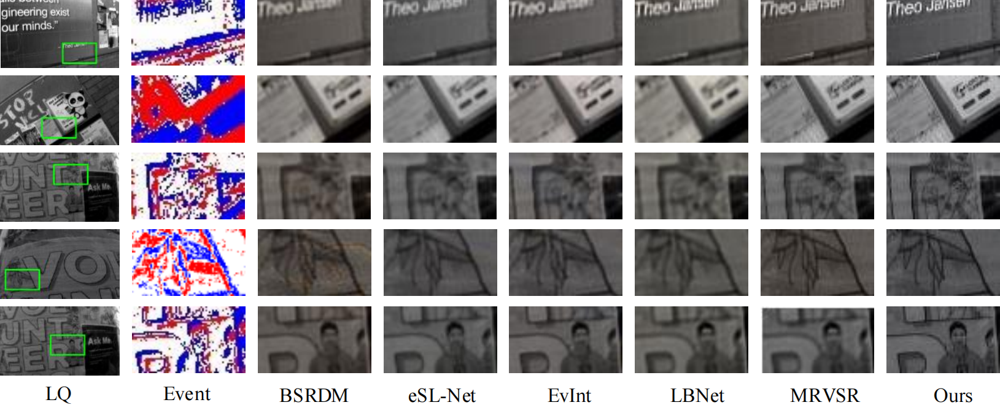

# SC-Net

<!--  -->


This repository provides the official PyTorch implementation of the following paper:

**Event-driven Video Restoration with Spiking-Convolutional Architecture**


Chengzhi Cao, Xueyang Fu*, Yurui Zhu, Zhijing Sun, Zheng-jun Zha

IEEE Transactions on Neural Networks and Learning Systems

[Paper Link](https://ieeexplore.ieee.org/abSCNetct/document/10314003)


## Dependencies

- Python
- Pytorch (1.4)
- scikit-image
- opencv-python

---

## Dataset

- Download SR dataset from the [NFS-SR dataset](https://openaccess.thecvf.com/content/ICCV2021/html/Han_EvIntSR-Net_Event_Guided_Multiple_Latent_Frames_Reconstruction_and_Super-Resolution_ICCV_2021_paper.html) .

- Download Derain dataset from the [Derain dataset](https://github.com/hotndy/SPAC-SupplementaryMaterials) .


- Download deblur dataset from the [GoPro dataset](https://seungjunnah.github.io/Datasets/gopro.html) .

- Unzip files ```dataset``` folder.

- Preprocess dataset by running the command below:

  ``` python data/preprocessing.py```

After preparing data set, the data folder should be like the format below:

```
GOPRO
├─ train
│ ├─ blur    % 2103 image pairs
│ │ ├─ xxxx.png
│ │ ├─ ......
│ │
│ ├─ sharp
│ │ ├─ xxxx.png
│ │ ├─ ......
│
├─ test    % 1111 image pairs
│ ├─ ...... (same as train)

```

- Utilize [V2E](https://github.com/SensorsINI/v2e) to generate the corresponding event sequence.

- Preprocess events by running the command below:

  ``` python data/dataset_event.py```

---

## Train

To train SCNet , run the command below:

``` python main.py --model_name "SCNet" --mode "train_event_Temporal" --data_dir "dataset/GOPRO" ```

Model weights will be saved in ``` results/model_name/weights``` folder.

---

## Test

To test SCNet , run the command below:

``` python main.py --model_name "SCNet" --mode "test" --data_dir "dataset/GOPRO" --test_model "xxx.pkl" ```

Output images will be saved in ``` results/model_name/result_image``` folder.

---

## Contact
Should you have any question, please contact chengzhicao@mail.ustc.edu.cn.

## Notes and references
The  code is based on the paper:

'Rethinking Coarse-to-Fine Approach in Single Image Deblurring'(https://arxiv.org/abs/2108.05054)

'Event-driven Video Deblurring via Spatio-Temporal Relation-Aware Network'(https://www.ijcai.org/proceedings/2022/112)
