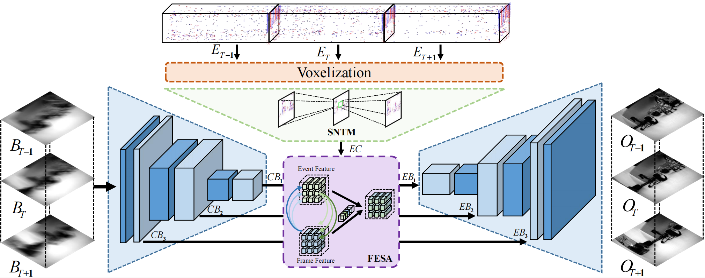

# SC-Net

<!--  -->


This repository provides the official PyTorch implementation of the following paper:

> Event-driven Video Restoration with Spiking-Convolutional Architecture
>
> Chengzhi Cao, Xueyang Fu*, Yurui Zhu, Zhijing Sun, Zheng-jun Zha
>
> IEEE Transactions on Neural Networks and Learning Systems
>
> [Paper Link](https://ieeexplore.ieee.org/abstract/document/10314003)
>
> With high temporal resolution, high dynamic range, and low latency, event cameras have made great progress in numerous low-level vision tasks. To help restore low-quality video sequences, most existing event-based methods usually employ convolutional neural networks (CNNs) to extract sparse event features without considering the spatial sparse distribution or the temporal relation in neighboring events. It brings about insufficient use of spatial and temporal information from events. To address this problem, we propose a new spiking-convolutional network (SC-Net) architecture to facilitate event-driven video restoration. Specifically, to properly extract the rich temporal information contained in the event data, we utilize a spiking neural network (SNN) to suit the sparse characteristics of events and capture temporal correlation in neighboring regions; to make full use of spatial consistency between events and frames, we adopt CNNs to transform sparse events as an extra brightness prior to being aware of detailed textures in video sequences. In this way, both the temporal correlation in neighboring events and the mutual spatial information between the two types of features are fully explored and exploited to accurately restore detailed textures and sharp edges. The effectiveness of the proposed network is validated in three representative video restoration tasks: de-blurring, super-resolution, and de-raining.
Extensive experiments on synthetic and real-world benchmarks have illuminated that our method performs better than existing competing methods.

---

## Contents

The contents of this repository are as follows:

1. [Dependencies](#Dependencies)
2. [Dataset](#Dataset)
3. [Train](#Train)
4. [Test](#Test)

---

## Dependencies

- Python
- Pytorch (1.4)
- scikit-image
- opencv-python

---

## Dataset

- Download deblur dataset from the [GoPro dataset](https://seungjunnah.github.io/Datasets/gopro.html) .

- Unzip files ```dataset``` folder.

- Preprocess dataset by running the command below:

  ``` python data/preprocessing.py```

After preparing data set, the data folder should be like the format below:

```
GOPRO
├─ train
│ ├─ blur    % 2103 image pairs
│ │ ├─ xxxx.png
│ │ ├─ ......
│ │
│ ├─ sharp
│ │ ├─ xxxx.png
│ │ ├─ ......
│
├─ test    % 1111 image pairs
│ ├─ ...... (same as train)

```
- Preprocess events by running the command below:

  ``` python data/dataset_event.py```

---

## Train

To train STRA , run the command below:

``` python main.py --model_name "STRA" --mode "train_event_Temporal" --data_dir "dataset/GOPRO" ```

Model weights will be saved in ``` results/model_name/weights``` folder.

---

## Test

To test STRA , run the command below:

``` python main.py --model_name "STRA" --mode "test" --data_dir "dataset/GOPRO" --test_model "xxx.pkl" ```

Output images will be saved in ``` results/model_name/result_image``` folder.

---

## Contact
Should you have any question, please contact chengzhicao@mail.ustc.edu.cn.

## Notes and references
The  code is based on the paper 'Rethinking Coarse-to-Fine Approach in Single Image Deblurring'(https://arxiv.org/abs/2108.05054)
